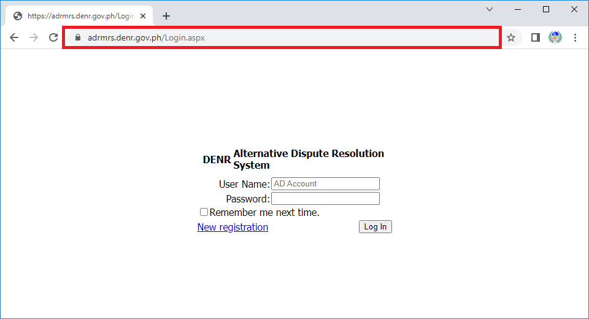
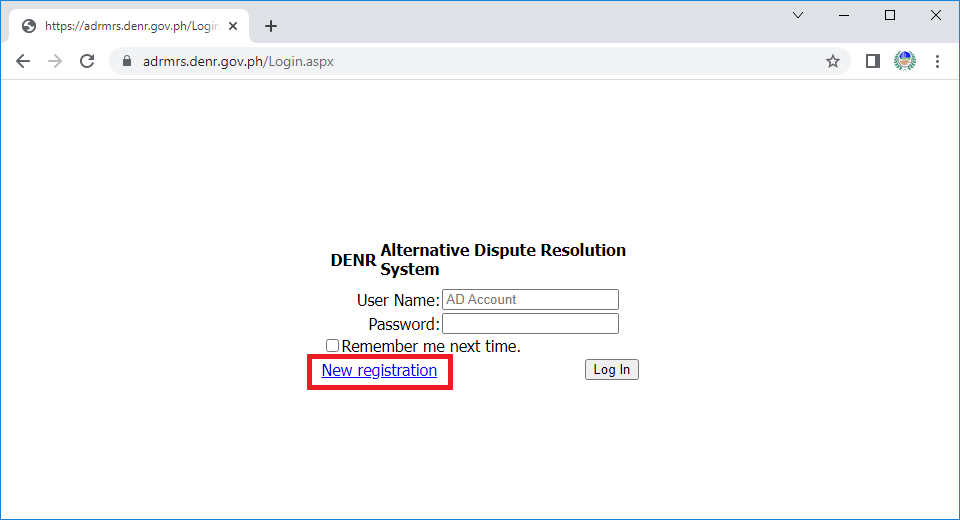
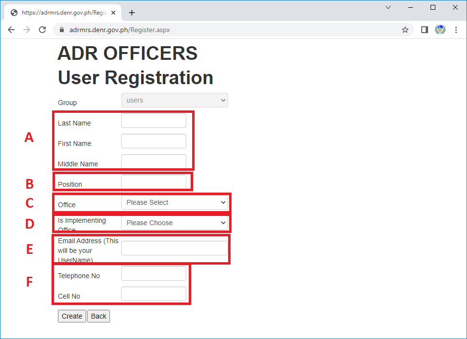

Please type in the **address bar** of your computer or mobile device’s (smartphone or tablet computer) browser the web address or Uniform Resource Locator (URL) https://adrmrs.denr.gov.ph/, then press the Enter Key.

-------------------------

Using your mouse pointer, _click_ **New Registration** to allow new users to register to the System as encircled below.

-------------------------

Fill in the necessary data as indicated in the form.
	A.	Name
    B.	Office Position
	C.	Office Type - either Regional, PENRO, and CENRO.
    D.	For PENROS only - is the office administrative only or implementing ADR like a CENRO.
	E.	Email Address - this will serve as your username as well.
    F.	Contact Numbers
    

