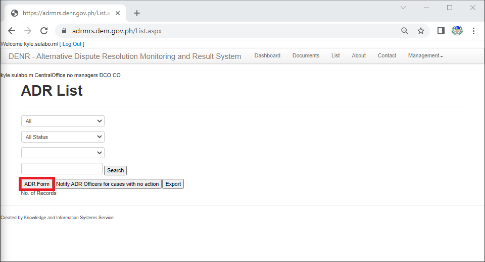
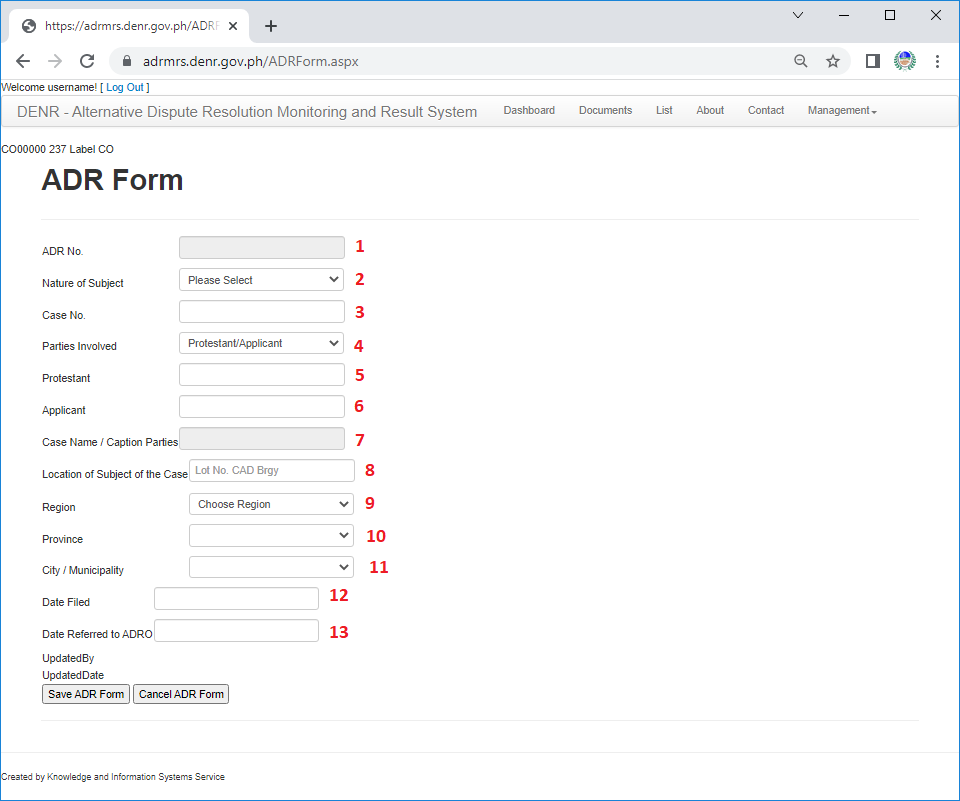

To start input cases, click "**List**" link on the menu bar.

After clicking the link, the user should see List page. 
Click the "**ADR Form**" button.

After clicking the button, the user should be able to see the ADR entry from. 
The user should fill in the correct information as labeled in the form.

Form Requirements Definition:
1.	**ADR No.** - This is automatically generated once the form is saved.
2.	**Nature of Subject** - Select what kind of dispute classification is ADR case.
3.	**Case No.** - Place the office designated classification number of the case.
4.	**Parties Involved** - Select what kind of parties involved for ADR.
5.	**Protestant** - Name of the Protestant. (changes based on the selection on _Parties Involved_)
6.	**Applicant** - Name of the Applicant. (changes based on the selection on _Parties Involved_)
7.	**Case Name / Caption Parties**	-  This is automatically generated once the form is saved. This is based on entries in part 5th and 6th of the form.
8.	**Location Subject of the Case** - Specific Lot No., Plot No. that can be used to pinpoint the location in question.
9.	**Region** - Region where the case is under.
10.	**Province** - Province where the case is under.
11.	**City / Municipality** - City / Municipality where the case is under.
12.	**Date Filed** - \*need clarifications\*
13.	**Date Referred to ADRO** - Date of protest received.

After saving the form, the user will be redirected to the List page.