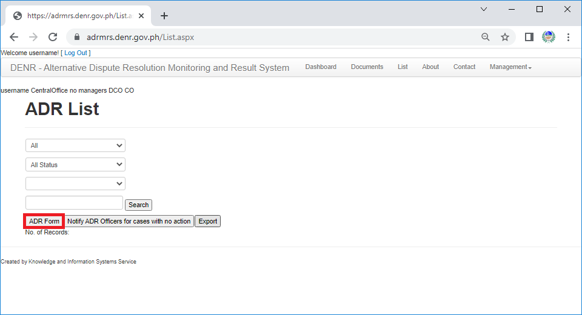

To start input cases, click "**List**" link on the menu bar.

After clicking the link, the user should see List page. 
Click the "**ADR Form**" button.

After clicking the button, the user should be able to see the ADR entry from. 
The user should fill in the correct information as labeled in the form.

Form Requirements Definition:
1.	aaaa
